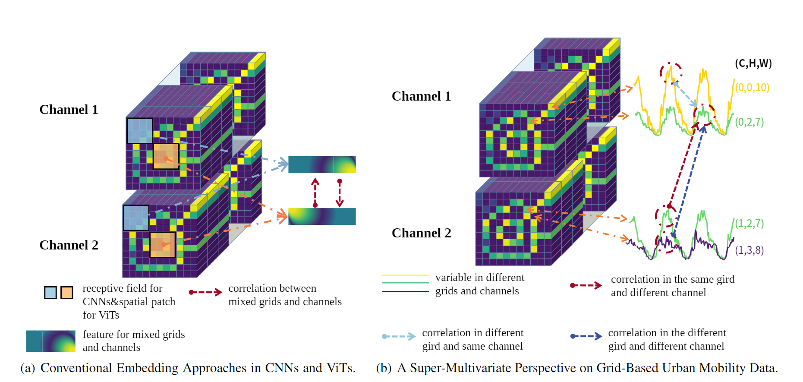
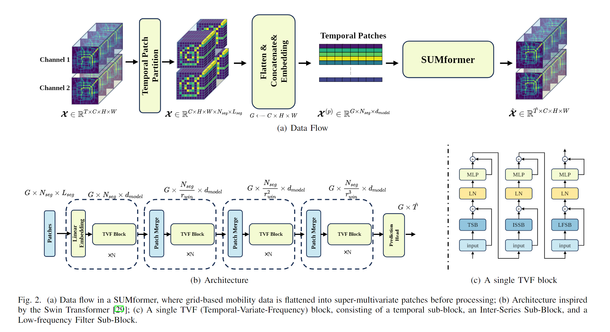

# Rethinking Urban Mobility Prediction: A Super-Multivariate Time Series Forecasting Approach (SUMformer)
 This is the first pytorch implementation for Our Paper: [Rethinking Urban Mobility Prediction: A Super-Multivariate Time Series Forecasting Approach](https://arxiv.org/abs/2312.01699).

## Overview 

Long-term urban mobility predictions play a crucial role in the effective management of urban facilities and services. Conventionally, urban mobility data has been structured as spatiotemporal videos, treating longitude and latitude grids as fundamental pixels. Consequently, video prediction methods, relying on Convolutional Neural Networks (CNNs) and Vision Transformers (ViTs), have been instrumental in this domain. In our research, we introduce a fresh perspective on urban mobility prediction. Instead of oversimplifying urban mobility data as traditional video data, we regard it as a complex multivariate time series. This perspective involves treating the time-varying values of each grid in each channel as individual time series, necessitating a thorough examination of temporal dynamics, cross-variable correlations, and frequency-domain insights for precise and reliable predictions. To address this challenge, we present the Super-Multivariate Urban Mobility Transformer (SUMformer), which utilizes a specially designed attention mechanism to calculate temporal and cross-variable correlations and reduce computational costs stemming from a large number of time series. SUMformer also employs low-frequency filters to extract essential information for long-term predictions. Furthermore, SUMformer is structured with a temporal patch merge mechanism, forming a hierarchical framework that enables the capture of multi-scale correlations. Consequently, it excels in urban mobility pattern modeling and long-term prediction, outperforming current state-of-the-art methods across three real-world datasets.
<p align="center">
    
</p>

## Key Contributions

Our contributions to the long-term urban mobility prediction challenge using SUMformer are as follows:

- We present a novel super-multivariate perspective on grid-based urban mobility data. Through this approach, we are able to utilize general multivariate time series forecasting models to achieve long-term urban mobility predictions.

- We present the SUMformer: a Transformer model designed to leverage temporal, frequency, and cross-variable correlations for urban mobility forecasting. Notably, it stands out as one of the few Transformer models that explicitly taps into and harnesses cross-variable correlations across every channel and grid for urban mobility prediction.

- Experiments  demonstrate that SUMformer surpasses state-of-the-art methods across three real-world datasets. We emphasize the significance of the super-multivariate perspective, explicit cross-variable correlation modeling, and frequency information for achieving optimal performance.

  

  <p align="center">
      
  </p>

## Data Visualization

<p align="center">
    
</p>


## Data Download

You could download the dataset from here: [Google Drive](https://drive.google.com/drive/folders/1Kdw-RsWYt7pLUlKNg_3R9Ypw6pZGTrCu?usp=drive_link)

## Usage

```angular2html
python Sumformer_origin_exp_full.py --device cuda:1 --dataset NYC --pth pth/SUMformer_AD_128NYC.pth 
--batch 16 --lr 0.00075
--layer_scaler 1 --layer_type AD 
--layer_depth [2,2,6,2]
```
If you want your own data.

1. Make sure your traffic flow data in the format of (T,C,H,W).

2. Modified the date and time interval in datasets/Generate_TAXI_PHV_hotmap.py
3. Make sure the length of the time stamps match the traffic flow data.
```angular2html
python datasets/NYC_time_stamp.py to generate the time stamps for custom data. 
```
